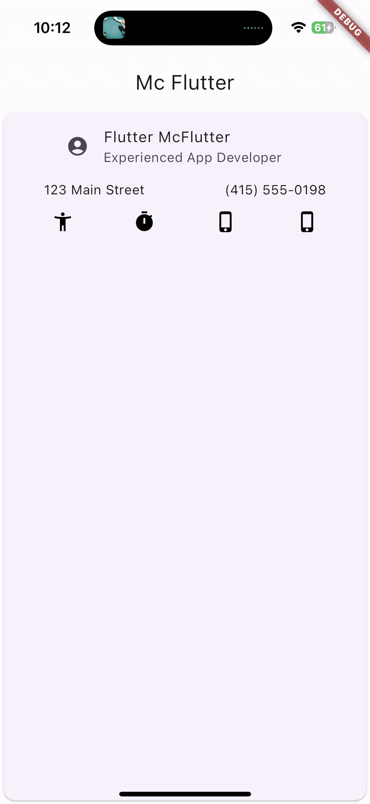

# act_1

A new Flutter project.

## Actividad 1 Conociendo los Scaffold y widgets mas comunes

- Widgets
- Scaffold
- Columns
- Colors
- State of the app

## Lo que me costo mas trabajo

- Understand how the Data layer works on Dart.
- How to build the layers since is a bit confusing.

## Lo que aprendi

- [Dart] how to manage the States
- [POO] how to work with class interactions on dart
- [Markdown] How to build READMEs

## Screens

