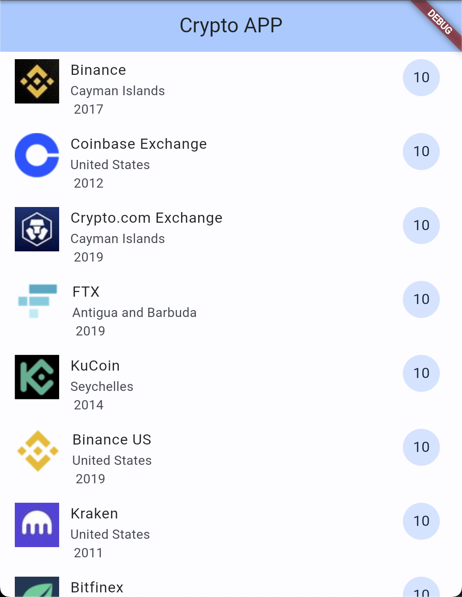
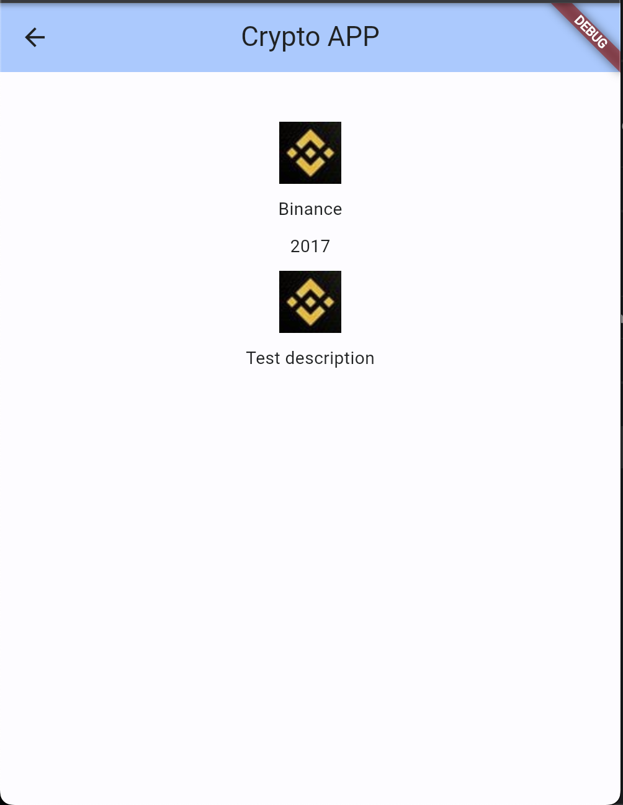
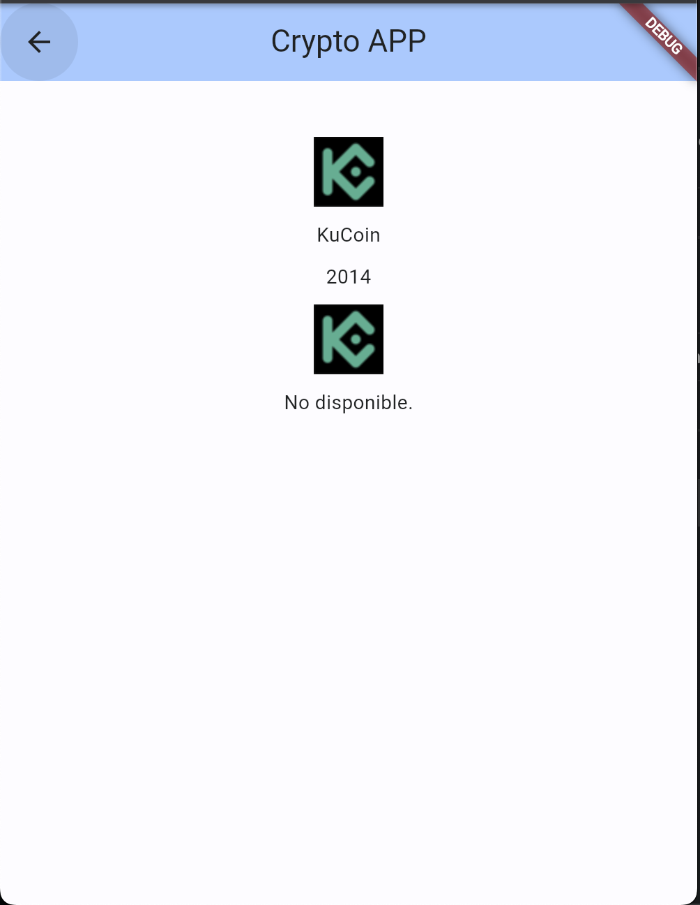

# crypto_look

App para practicar el uso de widgets

## Actividad 4 Conociendo los Scaffold y widgets mas comunes

- List view
- List tile
- Cargar datos de un JSON / Mapa

## Lo que me costo mas trabajo

- Hay un error de cors que no permitia que las imagenes se vieran
- El paso de datos de una vista a otra
- El hot reload que no cargaba

## Lo que aprendi

- [Dart] How to send data between states
- [Flutter] How to interpolate data
- [Dart] How to manage jsons

## Screens

