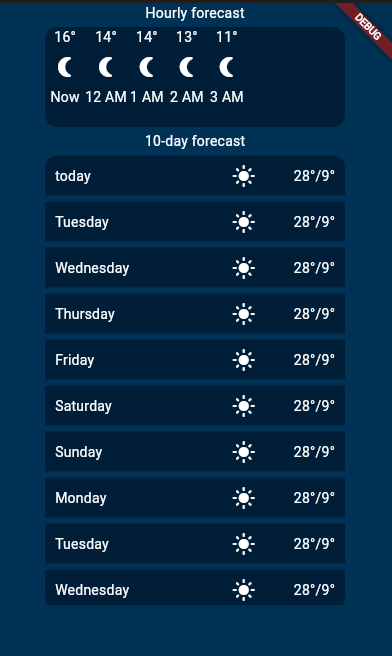

# tarea_2

A new Flutter project.

## Actividad 1 Conociendo los Scaffold y widgets mas comunes

- Widgets
- Scaffold
- Columns
- Colors
- Snackbar
- State of the app
- How to dynamically add elements on a listView

## Lo que me costo mas trabajo

- Integrar el snackbar una vez que ya estaban los estilos
- Arreglar los estilos del hourly Forecast ya que no me los tomaba en cuenta

## Lo que aprendi

- [Dart] how to manage the States
- [Snackbar] component
- [POO] how to work with class interactions on dart
- [Markdown] How to build READMEs
- [ListView] How to manage diferent ListViews

## Screens

